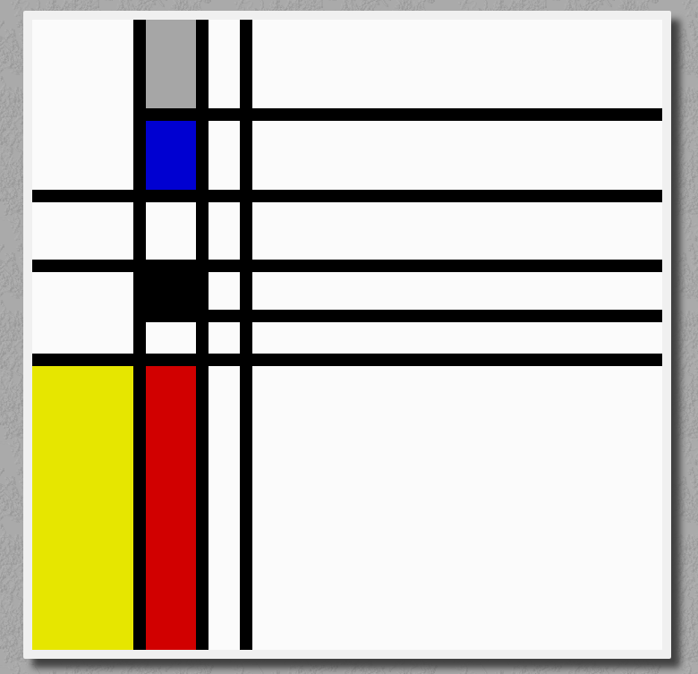

# Wandering through M-space

This demo plays with Mondriaan's paintings, the ones with the lines and the colored rectangles he made in his Paris, London, New York period.

In order to generate a painting we need to know [the elements](doc/elements.md), from these we can create several [types of paintings](doc/types-of-paintings.md) , using [an algorithm](doc/algorithm.md) .

## Process

Each frame is crafted from a series of style elements: double-lines, colored-lines, thick-lines, grid, and tape.

The tour in this demo highlights each of these style elements in order.

